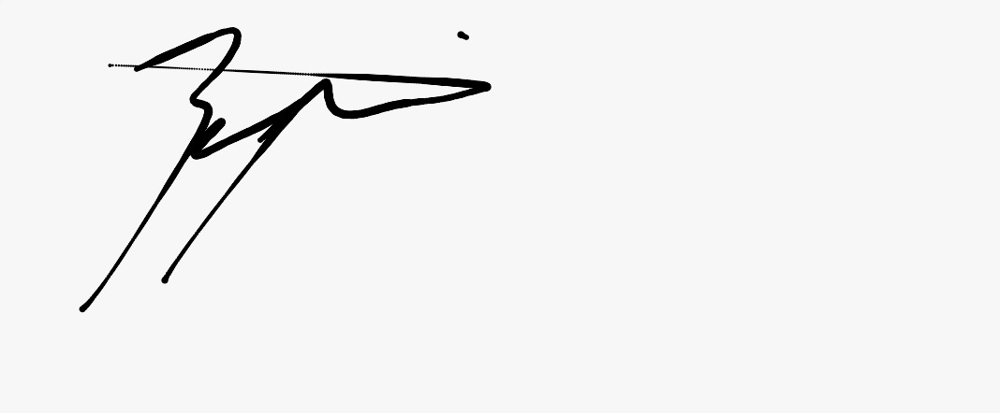
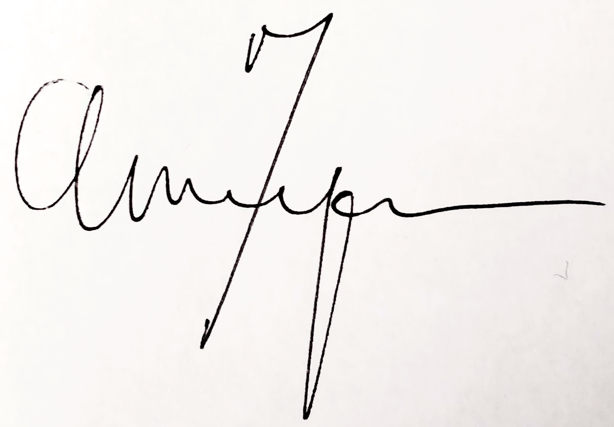
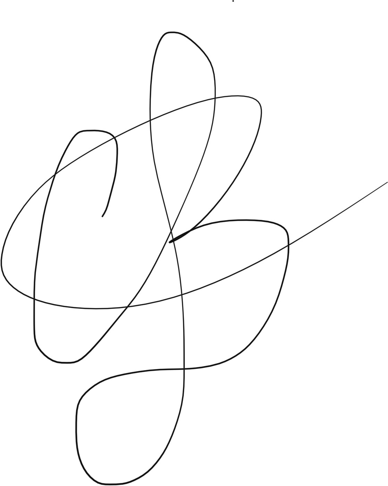
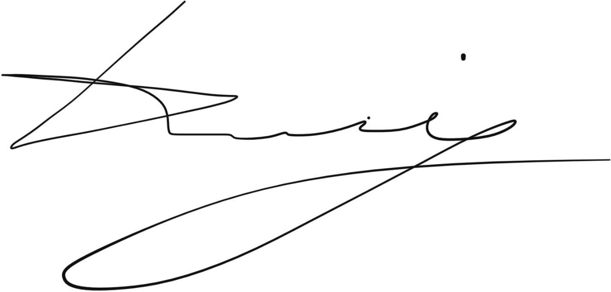
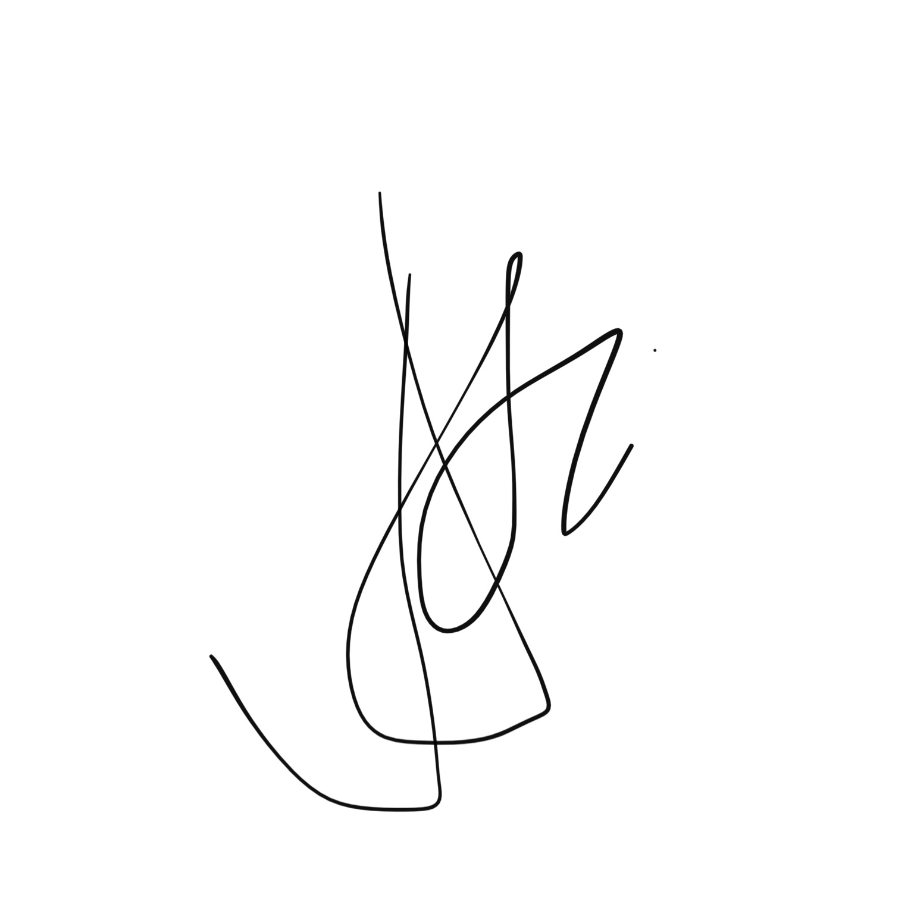
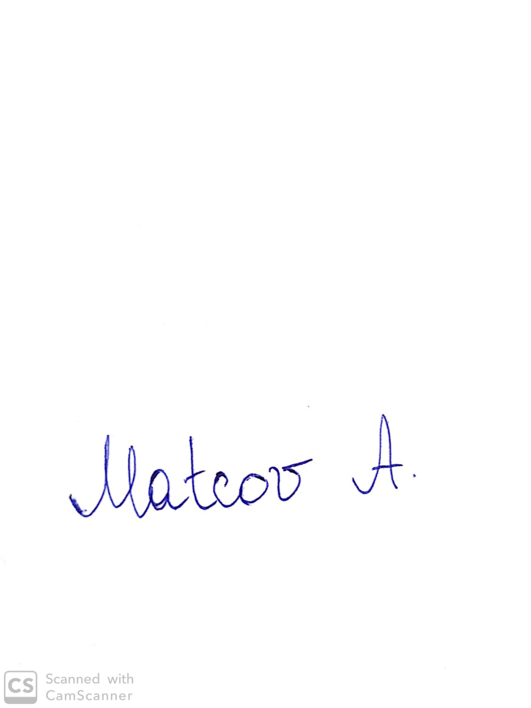

# Software Design Document

|| **Names/Ids**  |
|--:|:--|
| *Team ID:* | 22 |
| *Team members:* | Jasper van Amerongen, Illya Averchenko, Alexandru Matcov, Albina Shynkar, Lola Solovyeva, Bugra Veysel Yıldız |

## 1. Code of Conduct (Mention at least 10 Code of Conduct for your Team.)

This is expected to understand the degree of professionalism throughout the project length. It is also a kind of warning to the team members not following the conduct.

As a project team ...
* … we will not tolerate intentional rudeness or other harmful verbal communication in meetings as it affects the quality of the project.
* … we will share all the project related responsibilities equally or as we see fit otherwise.
* … we will follow the contracting rules.
* … we will be disciplined and honest throughout the project.
* … we will follow the Red/Orange card  procedure for any kind of warnings against team members, in case we find this necessary unanimously.
* … we will respect each other's views and focus on the project quality or as we see fit otherwise.
* … we will never be afraid of learning new things to improve productivity.
* … we understand that communication is a vital aspect of teamwork.
* … we shall not take credit for other members’ work.
* … we should respect each other’s time and show up on every meeting without being late 
## 2. Project Goals? (Mention at least 5)
* Understanding the theoretical knowledge and concept that we are going to use in the project.
* Fulfilling all the functional and non-functional requirements that we set.
* Use the knowledge that we learn from the lectures in practical.
* Aim for the highest grade possible 
* Be aware of how different parts of the project interact with each other and work as a whole system
## 3. Strengths and Weaknesses (Mention at least 5)
### 3.1 Strengths
* Half of the group worked together before and is therefore very capable and efficient in collaborating
* We have divided our group by harmoniously working 3 subteams: back and front end and physical layer, which makes task dividing easier and work more efficient.
* We already experienced in how sprints should work and are familiar with workflow for such type of the project
* We have a diverse team in regard of nationality, sex, knowledge and skill.
* We are listening to each other's ideas and taking into account all thoughts.
* We are always there for each other to help with any issue at any time.
* We have good communication in messengers, where we are always welcome to ask some questions about the project or module in general.
### 3.2 Weaknesses
*  Nobody had any experience working with Raspberry Pi 
*  Due to a high workload we focus less on the project 
*  Lack of communication between  subteams
*  Since we are friends (except for Illya, he does not have friends), sometimes we lose focus and have fun instead
* Sometimes, we avoid confrontation. 
* Lack of the man, the legend, the master himself… Mister Adamo Mariani.
## 4. Team meeting ground rules (Mention at least 3)
### 4.1 Participation (What is your group planning for team participation?):
* **4.1.1:**
* **4.1.2:** 
* **4.1.3:** 
### 4.2 Communication (How do you communicate with each other? Any rules for communication?)
* **4.2.1:** For online meetings, we use either the software provided by the supervisors of Google Meet.
* **4.2.2:** WhatsApp is used as an intermediate platform of communication.
* **4.2.3:** Jitsi is used for the stand up meetings.
### 4.3 Problem Solving ( What approach do you follow to solve a project task?)
* **4.3.1:** During stand up meetings or on Zulip, if we have a question, we ask the scrum mentors which is present.
* **4.3.2:** We look internet resources for solving the problems that we have
* **4.3.3:** We use the communication tools that we mentioned to help each other to solve our question.
### 4.4 Decision Making (How do you decide the number of project-related tasks and the team member to complete the task? Elaborate)
* **4.4.1:** Tasks are divided within subteams.
* **4.4.2:** More global decisions are made between subteams and moreover by discussing all viable outcomes and impacts of said decision.
* **4.4.3:** When it comes to delegation of the specific task we refer to the sub groups that are responsible for the particular part of the project and see who shows more initiative out of the two people. 
### 4.5 Handling Conflict (Any conflicts you encountered before? How did you handle that or how will you react to the team conflicts?)
* **4.5.1:** If a member is not attending a meeting or other planned team event, they are required to bring beer for those who are in favor to the next event.
* **4.5.2:** 
* **4.5.3:** 
### 4.6 Deadlock Situation (Who will you approach to continue the progress of your project due to a kind of disagreements within your team?)
* **4.6.1:** We will solve this problem internally.
* **4.6.2:** If 4.6.1 fails, we will contact the mentors.
* **4.6.3:** If 4.6.2 fails, we will contact the project and/or module coordinator.

## 5. Areas for Growth (Mention at least 5)
* Improving communication skills within the team.
* Improving time management of each team member and a team as a whole.
* Improving soft skills as problem-solving and critical thinking.
* Improving our knowledge regarding raspberry pi, programming languages used in the project.
* The project grade.

## Team members' Signature

I, undersigned, hereby declare that I have read, agreed, and accepted all the rules and commitments mentioned in this document during the project, Course: Computer Systems, Module 5 (2020-21).

Bugra Veysel Yildiz
05-10-2020

Jasper van Amerongen
05-10-2020

Lola Solovyeva
05-10-2020

Albina Shynkar
05-10-2020

Illya Averchenko
05-10-2020

Alex Matcov
05-10-2020

