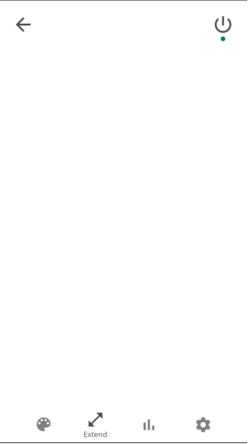

# Software Design Document 

|| **Names/Ids**  |
|--:|:--|
| *Team members:* |Jasper van Amerongen, Illya Averchenko, Alexandru Matcov, Albina Shynkar, Lola Solovyeva, Bugra Veysel Yıldız |
| *Team ID:* | 22 |

**Instructions:**
* Make a document by including all the suggested sections.
* The document should be 1500-2500 words.
 ## Introduction
**(The overview of the entire document is mentioned.)**

Welcome to the Software Design Document for module 5 project group 22. Below is described how we plan on realizing our system in a technical way. The physical (hardware) part is excluded.
As we have already described in previous documents, we are building a system that will enhance the lighting solution within your home entertainment setup. An LED strip will be placed around your screen or TV and shine parallel to the wall. The light level of the white LEDs will be linearly dependent on the resistance of an LDR, which will measure the ambient light level. When a threshold is reached, the system will turn on these LEDs. This is our minimal viable product.
Advanced features will include the altering of the colour, animating movement of said colour, preset modes and the collection and displaying of the LDR’s readouts. 
## Product User Interface
**(Create illustrations and design of your product and explain the tools used for the design. Include UML diagrams of your application for better understanding.)**

As having developed a virtual coffee corner, including a chat and bulletin functionality, as well as an event planner, with one half of this team, we understand how important a good user interface and user experience is. This is something we focussed on from the beginning of designing and with that mindset followed a mobile-first approach.

### Mockup
In Module 4, our teacher Wallace Ugulino and Léon “The Fries” de Vries recommended that we use an online prototyping tool called Marvel. Using this software, it is really easy to create geometric vector images that represent webpages. These images can then be linked together by means of selecting an area of the image suited for interaction. These interactions can be clicking or swiping etc. Linking multiple pages with multiple unique links, a great prototype can be built. Below are the unique pages we designed for the mockup. We highly recommend that you take a look yourselves: https://marvelapp.com/prototype/51fe2af/screen/73181115.

 

 

 

 

 

 

 

### UML diagrams
UML diagrams allow us to communicate words and ideas regarding software design and interaction in a formal way. For example, a class diagram visualizes the interaction and relation between classes.

#### Activity Diagram
Activity diagram that we have represents the dynamic aspects of the system. It's a flowchart that explains the steps from one activity to the next one. Since the user that we have is going to interact with the web application that we are going to have, we decided to create an activity diagram to express how the backend of the system will handle the commands and activities that user will transmit. In the diagram that we created, we decided to use 3 swim lanes which are the user, Google and the system. Since the users are going to log in to the system with Google authorization, it handles some of the log in and log out activities when they convey the request. All the other commands like changing the colors, changing the brightness, animations and presets which are the different modes of the LED lights that the user can select will be handled by the backend of our system. These activities that the user interacts with the product we get has been represented within the activity diagram which can be found on the GitLab. 
 

#### Class Diagram
We also decided to create a Class diagram since it provides a visual representation of our system and better understanding of how different parts of systems are going to interact with each other. Our diagram turned out pretty straightforward and even simple. We included 5 Controller classes that are responsible to figure which services are needed, when a user performs specific interactions with the system: configure and update the number of LED lights to be used; change the mode, color and brightness; request for data to be displayed in graphical form.  Furthermore, each controller creates a DAO class for a specific action to be performed. It is used to separate low level data accessing API or operation from high level services. DAO uses actual classes that have attributes and getters with setters. The classes that are responsible for changing colors, animations and sets have a direct connection to a configuration class that sets the number of LEDs to be used.  

 

## Requirements/System Overview 
**(Overall functionality of the system is explained with user requirements and functional requirements. Describe the scenario when your system can fail.)**

Ideally, the final product should have following features: 
The user should be able to turn light on and off via user interface according to how bright it is in  the room. However, the system itself via the LDR sensor should understand when it is too dark or too bright in the room to change the brightness of the light accordingly. The lighting level in general should be accessible to be changed by user interface. System has to be responsive to the user’s choice of a color. The LED lights need to have different modes of colors which can be controlled by the user interface. Lights have to move, flow, pulsate according to the music beat.  The user needs to be able to determine the lengths of the display by inputting it in the user interface. The system should be suitable for any type of display, either small laptop monitors or wide TV screens. 
In the end, if we will have enough time to develop advanced features of the system, we will implement following features: 
The system will be able synchronize the LED lights with the music playing in the background.
The system will be able to synchronize colors of the LEDs with the most popular color of the picture/video on the display. Finally, the system will be able to synchronize the LED lights with the music playing in the background.

## Milestones
**(This is basically to understand the project scope. It should be described according to the number of jobs required for your application to the final deliverable.)**

We set couple of milestones to make sure that we are on track with our project and can meet all of the requirements for the passing grade(mvp):
* Meet all deadlines for Canvas assignments
* Keep up with project phases
* Make UML diagrams for better understanding of how the system works
* Buy LED strip 
* Connect front-end, back-end and raspberry pi 
* Prepare well for the presentation for a better explanation of our system to our student fellows and product owners 
*Don’t let all the exams and assignments make us to lose focus from the project 
## Requirement Priorities
**(You are required to prioritize the functionalities to build your Minimal Viable Product. It should be stated clearly.)**

At the beginning of the implementation it is important to clearly state the minimal requirements and functionalities of the product to have a minimal goal we should achieve.  In other words, we should build and provide Minimal Viable Product. Even at the start phase our team identified this point we should reach and after we develop a minimal viable product how we will try to extend the requirements. Regarding functionalities of our Minimal Viable Product, we identified the following ones:
* Turn the light on/off according to how bright it is in the room. 
* The system needs to be able to turn on and off the LED lights from the user interface.
* The LED lights need to be activated according to the light level in the room via LDR sensor.
* The light level of the LED lights need to be arranged from the user interface.
* System has to be responsive to the user’s choice of a color.
* The LED lights need to have different modes of colors which can be controlled by the user interface.
* The user needs to be able to determine the lengths of the display.
* The system should be suitable for any type of display, either small laptop monitors or wide TV screens.
## Conclusion

**(You can give the concluding statements of your document.)**
As you can see so far, this document was made for a description of how we are going to realize our plan to build a smart home lighting system, also mentioning some technical aspects. To sum up, our main goal is to get the minimum viable product, which is going to control brightness of the LED strip, depending on the level of brightness in the room. However, we still are planning to enhance it with more features, which we planned beforehand as can be seen in the UML diagrams and requirements we have provided.   
## Reference
* Our live mockup: https://marvelapp.com/prototype/51fe2af/screen/73181115 
* Document that formed the basis of our motivation: https://tools.ietf.org/html/rfc2549 
